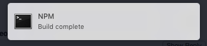

Send OS X terminal notifications from your NPM run scripts:

```
"watch": "npm-run-all compile notify",
"compile": "false", // <- insert your own compile step here
"notify": "npm-run-notify --message 'Build complete' --title 'NPM'"
```

and receive OS X notifications when your 'compile' step finishes:



## Installation

```
npm install --save-dev npm-run-notify
```
